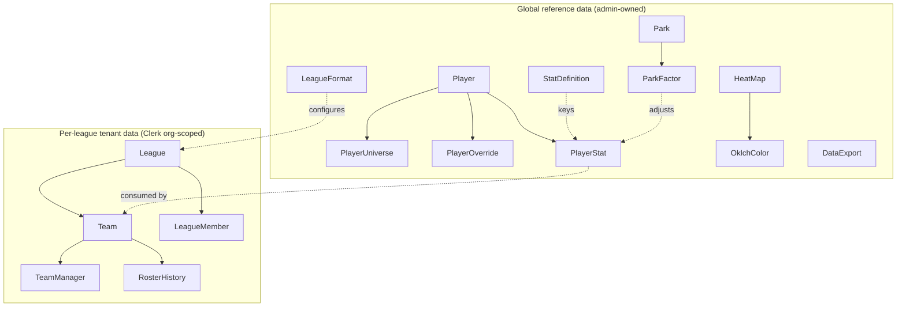

# BBQ — Conceptual Overview

> **Type:** reference &nbsp;|&nbsp; **Status:** as-built &nbsp;|&nbsp; **Last reconciled:** 2026-06-14

The north-star for the project. Every other spec in `docs/` refines one slice of
what is described here. Read this first.

## What BBQ is
**BBQ (Baseball + Queue)** is a fantasy-baseball draft platform. It gives a
league's members a shared, accurate picture of the player pool — canonical
identities, projections and actuals, park-adjusted context, and league-specific
roster/finance state — so they can prepare for and run a draft.

The current build is a **Dev-stage** working prototype: a rich admin/data
backbone (player universe, stats, parks, formats, exports, visualization) plus
the multi-tenant league/team/roster model. The live-draft experience itself is
not yet built (see [Next](#next--open-questions)).

## Who it serves
Identity and tenancy run through **Clerk**. One **league = one Clerk
Organization**. Within a league, members hold a `LeagueMemberRole`:

| Role | Can |
|---|---|
| `COMMISSIONER` / `CO_COMMISSIONER` | Administer the league: teams, members, format, settings |
| `MANAGER` / `CO_MANAGER` | Run a team within the league |
| `ONLOOKER` | Read-only access |

A separate, platform-wide **admin** capability (Clerk `publicMetadata.role =
"admin"`) governs the global reference data (players, stats, parks, formats,
exports) that all leagues draw from. See [auth.md](auth.md).

## Core domains
The system is five bounded contexts. Each has (or will have) its own spec:

1. **Player Universe & Stats** — canonical `Player` identity reconciled across 9+
   external ID systems, format-specific `PlayerUniverse`, manual `PlayerOverride`,
   and JSONB `PlayerStat` rows spanning projections, actuals, neutralized, and
   splits. → [schema.md](schema.md), [player_data.md](player_data.md), [admin.md](admin.md)
2. **Leagues, Teams & Roster** — multi-tenant `League`/`Team`/`LeagueMember`/
   `TeamManager`, JSONB rosters and finances, and an immutable `RosterHistory`.
   → [schema.md](schema.md), [api.md](api.md)
3. **League Formats** — reusable `LeagueFormat` bundles (platform × play-type ×
   scoring × draft) that configure a league. → [formats.md](formats.md)
4. **Parks & Factors** — `Park` and `ParkFactor` data for park-adjusted, by-bat-side
   context. → [parks.md](parks.md)
5. **Visualization & Export** — `HeatMap`/`OklchColor` colour scales for stat
   visualization and `DataExport` column templates for outbound files.
   → [heat-maps.md](heat-maps.md), [data-exports.md](data-exports.md)

## Rollout stages
The project advances **Dev → Alpha → Beta → RC** (defined in `CLAUDE.md`).
Current stage is **Dev**: local Docker Postgres, free-tier services, schema
deliberately provider-agnostic so the cloud transition is a config change.

## Conventions that hold everywhere
- **Soft delete** — most models carry `deletedAt`; application code never hard-deletes.
  Every read filters `deletedAt: null`. → [schema.md](schema.md)
- **App-layer security** — no DB RLS yet; Clerk middleware + per-route guards +
  org/membership scoping. → [auth.md](auth.md)
- **JSONB for variable shapes** — stats, rosters, finances, and park factors are
  JSONB so they vary without a migration per source.
- **Docs are task-structured** — specs follow [`_template.md`](_template.md): intent
  and acceptance first, code-shaped detail last.

## Next / Open questions
- **Live/slow draft experience** — the draft room itself is not yet built; `LeagueFormat`
  already encodes `draftMode`/`draftType` to drive it.
- **Transactions** — a trade/FAAB history table is planned (see [schema.md](schema.md) Gaps).
- **RLS** — database-level row security is deferred to Beta/RC as defense-in-depth.
